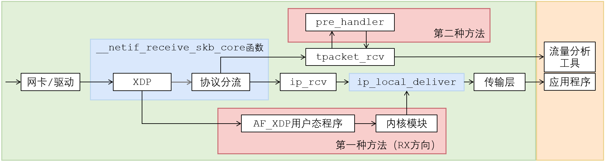
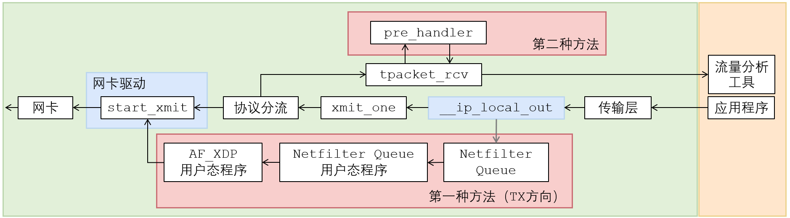

## 两种方法效果实验
videos目录存放两种方法效果实验录屏。

## 稳定性测试（针对审稿意见26-鲁棒性）
分别针对两种方法，实验一小时的iperf3流量绕过，实验录屏记录在`videos`目录下的`way1-1hour.mp4`和`way2-1hour.mp4`视频文件中。

## 速率实验、CPU使用率实验
### 测量原理
主机B作为iperf3服务端，主机A作为iperf3客户端，通过TC机制设置主机A和主机B之间的网络带宽。
首先在没有部署时，测量iperf3网络传输速率和CPU使用率。
然后构造背景流量和隐蔽流量，在部署时，测量iperf3网络传输速率和CPU使用率。

实验在腾讯云中进行（S9.4XLARGE32实例），两台主机的带宽固定为8Gbps，这个带宽是无法配置的。
于是实验选择使用软件方式——Linux TC机制设置两台主机之间的实际网络带宽。具体来说没有在主机A上配置，以免Linux TC的相关算法消耗处理器资源，干扰实验，于是选择在主机B上配置Linux TC的限速规则。脚本`limit.sh`实现了主机B的网络带宽限速。

### 测量过程

iperf3-data目录存放网络传输速率实验、CPU使用率实验数据。
数据来源iperf3，iperf3传入-J参数可以将测试日志以JSON的格式输出，测量结果记录了速率和CPU使用率，便于网络速率和CPU使用率数据的获取。
```
actual-*Mbps.json: 没有部署时，网络传输速率和CPU使用率实验结果。
way1-backgd-*Mbps.json: 部署第一种方法，背景流量网络传输速率和CPU使用率实验结果。
way1-covert-*Mbps.json: 部署第一种方法，隐蔽流量网络传输速率和CPU使用率实验结果。
way2-backgd-*Mbps.json: 部署第二种方法，背景流量网络传输速率和CPU使用率实验结果。
way2-covert-*Mbps.json: 部署第二种方法，隐蔽流量网络传输速率和CPU使用率实验结果。
```

`draw-throughput.py`和`draw-cpu.py`脚本会根据`iperf3-data`的实验结果，绘制网络传输速率影响图和CPU使用率影响图。

## 数据包处理时延实验
### 测量原理
构造UDP数据包，测量单个UDP包在系统中的处理时间，以此来评估部署两种方法引入的数据包处理时间。
#### 接收方向
在数据包接收方向，主机B使用`udp_burst.py`程序向主机A发送UDP数据包，UDP的负载是数据包的编号。
如果配置发送1024个数据包，那么这1024个数据包的编号分别是0，1，2 ... 1023。



无论是否部署，数据包先会被`__netif_receive_skb_core`函数处理。
当数据包被`__netif_receive_skb_core`函数处理时，通过内核提供的`ktime_get_ns()`函数获得当前时间。
测量方法会维护一个键值对数据结构。以数据包负载中的编号为键，以当前时间为值，写入键值对数据结构中。
当改数据包经过`ip_local_deliver`函数时，再次获取当前时间，同键值对数据结构中的初始值进行比较，差值就是数据包在`__netif_receive_skb_core -> ip_local_deliver`之间经历的时间。

由于内核编译环境的不同，`__netif_receive_skb_core`函数可能经过常量传播优化，导致该函数并不能直接被Kprobes插桩。
但是可以在`/proc/kallsyms`中获取其实际地址，命令如下：
```
sudo cat /proc/kallsyms | grep __netif_receive_skb_core
ffffffff91b12670 t __netif_receive_skb_core.constprop.0
```

对地址`ffffffff91b12670`进行插桩，就是`__netif_receive_skb_core`函数进行插桩。
该地址在不同机器上会有所变化，系统重启也会更改，因此每次启动系统后需要手动从`/proc/kallsyms`中获取`__netif_receive_skb_core`函数的地址。
获得到地址后，需要手动填充到`latency-measure/01_latency_udp_rx/01_latency_udp_rx.c`文件的第110行中，形如
```
108 static struct kprobe kp1 = 
109 {
110     .addr = (kprobe_opcode_t *)0xffffffff91b12670,
111     .pre_handler = nrsc_kprobe_pre_handler,
112 };
```

#### 发送方向
在数据包发送方向，主机A使用`udp_burst.py`程序向主机B发送UDP数据包。



对于发送方向的数据包，当数据包被`__ip_local_out`函数处理时获得当前时间，以数据包负载中的编号为键，以当前时间为值，写入键值对数据结构中。
当改数据包经过virtio的数据包发送实现函数`start_xmit`函数时，再次获取当前时间，同键值对数据结构中的初始值进行比较，差值就是数据包在`__ip_local_out -> start_xmit`之间经历的时间。

腾讯云云服务器使用virtio网卡，virtio网卡驱动使用`start_xmit`函数作为接管待发送数据包的函数，所以实验选择针对`start_xmit`函数进行插桩。
出于性能考虑，virtio没有将数据包的内容存储在skbuff的线性区域中，而是存储在分段区域中，所以`latency-measure/02_latency_udp_tx/02_latency_udp_tx.c`
从skbuff的`skb_shared_info`结构中读取数据包的内容，而不是从skbuff的data数组中读取数据包内容。

#### latency-measure目录
latency-measure目录存放处理实验相关脚本和代码。此部分有三个子目录：
```
way1-rx: ①第一种方法在接收方向对数据包处理引入的时延
way1-tx: ②第一种方法在发送方向对数据包处理引入的时延
way2:    ③第二种方法对数据包处理引入的时延
```
第二种方法实验时并不区分数据包方向（接收或发送），因为第二种方法在实现时并没有区分数据包的方向，统一处理所有方向的数据包。

#### latency-data目录
lantency-data目录存放数据包处理时延数据。在三个子目录下，各自有：
```
4999-bypass.txt：部署，背景流量数据包处理时延
4999-nobypass.txt：不部署，背景流量数据包处理时延
5000-bypass.txt：部署，隐蔽流量数据包处理时延
5000-nobypass.txt：不部署，隐蔽流量数据包处理时延
```
这四个文件均为内核日志输出文件（dmesg命令输出），筛选整理后导出到对应```.data.txt```文件。
`draw-latency.py`脚本会根据`latency-data`的实验结果，绘制箱形图，展示两种方法引入的数据包处理时间。
